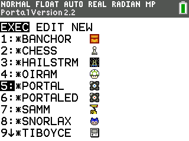
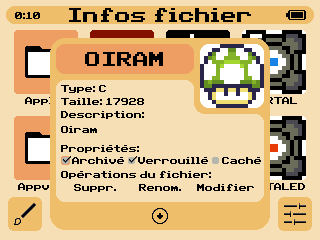
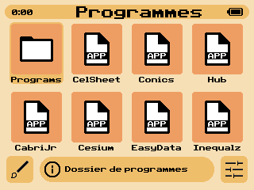
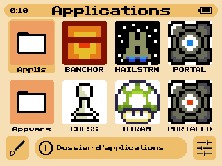
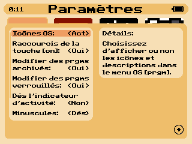

# CEaShell  

Traduction françise du fichier "readme" par Shadow.

CEaShell (prononcé "Seashell" de l'anglais) est un nouveau shell pour les calculatrices CE.
Il vise à fournir une interface moderne, élégante et facile à utiliser,
compréhensible par tout utilisateur, quelle que soit son expérience préalable ou ses 
connaissances dans le domaine des calculatrices.
Pour obtenir de l'aide, suggérer une fonctionnalité, ou signaler un bug, rejoignez notre Discord !

## Screenshots

    
      
      

## Fonctionnalités

* Exécution de programmes et d'applications
* Thèmes de couleurs personnalisés et préférences visuelles
* Affichage d'informations sur les programmes
* Modification des propriétés des fichiers (archivage/désarchivage, masquage/démasquage, suppression, etc..)
* Édition de programmes TI-BASIC
* Création de programmes et d'appvars
* Améliorations du système d'exploitation
* Icônes et descriptions des programmes dans le menu des programmes du système d'exploitation
* Et bien plus encore !

## Installation

1. Téléchargez la toute dernière version de CEaShell dans la page des publications [GitHub](https://github.com/roccoloxprograms/CEaShell/releases/latest).
2. Transférez **APPINST.8xp**, **AppInstA.8xv** et **AppInstB.8xv** sur votre calculatrice en utilisant TI-Connect CE ou TiLP.
3. Lancez **prgmAPPINST** depuis le menu des programmes (<kbd>prgm</kbd>). Vous devrez utiliser le jailbreak [arTifiCE](https://yvantt.github.io/arTIfiCE) si votre calculatrice est en version 5.5 ou ultérieure.
4. CEaShell sera installé et accessible via le menu des applications (<kbd>apps</kbd>).

## Désinstallation

1. Accédez à la gestion de la mémoire en effectuant la démarche ; <kbd>2nde</kbd>, <kbd>+</kbd>, <kbd>2</kbd>.
2. Faites défiler vers le bas jusqu'à ce que vous trouviez l'option "Apps".
3. Appuyez sur <kbd>entrer</kbd> et repérez CEaShell.
4. Appuyez sur <kbd>suppr</kbd> et confirmez en appuyant sur <kbd>2</kbd>.
5. Quittez la gestion de la mémoire en appuyant sur <kbd>annul</kbd>.

## Navigation

Ci-dessous vous trouverez un tableau avec les différentes touches et actions dans CEaShell :

| Touche                                                                      | Action effectuée                                                                       |
|-----------------------------------------------------------------------------|----------------------------------------------------------------------------------------|
| <kbd>2nde</kbd> / <kbd>entrer</kbd>                                         | Exécuter des programmes, basculer/sélectionner des éléments dans les menus.            |
| <kbd>↑</kbd>, <kbd>↓</kbd>, <kbd>←</kbd>, <kbd>→</kbd>                      | Faites défiler les options ou menus.                                                   |
| <kbd>y=</kbd>                                                               | Ouvrir/quitter le menu de personnalisation.                                            |
| <kbd>graphe</kbd>                                                           | Ouvrir/quitter le menu des paramètres.                                                 |
| <kbd>alpha</kbd> / <kbd>fenêtre</kbd> / <kbd>zoom</kbd> / <kbd>trace</kbd>  | Visualiser et modifier les propriétés des fichiers.                                    |
| <kbd>suppr</kbd>                                                            | Supprimer un fichier selectionné.                                                      |
| <kbd>mode</kbd>                                                             | Créer un nouveau fichier ou copier le fichier actuel selectionné.                      |
| <kbd>annul</kbd>                                                            | Quitter CEaShell.                                                                      |
| <kbd>a</kbd> - <kbd>z</kbd>                                                 | Redirection vers un programme commençant par la lettre appuyée.                        |
| <kbd>on</kbd>                                                               | Éteindre la calculatrice tout en étant sur le shell.                                   |

## Raccourcis

Si l'option **Raccourcis de la touche [on]** est activée sur CEaShell, les combinaisons de touches
suivantes exécuteront des utilitaires spécifiques dans l'OS :

| Combinaison de touches            | Action effectuée                                                                       |
|-----------------------------------|----------------------------------------------------------------------------------------|
| <kbd>on</kbd> + <kbd>prgm</kbd>   | Lancer CEaShell.                                                                       |
| <kbd>on</kbd> + <kbd>sto →</kbd>  | Inversion des couleurs de l'OS ("Mode sombre").                                        |
| <kbd>on</kbd> + <kbd>ln</kbd>     | Re-inversion des couleurs de l'OS ("Mode clair").                                      |
| <kbd>on</kbd> + <kbd>stats</kbd>  | Éteindre la calculatrice, et sauvegardez l'endroit ou vous vous êtes arrêtés sur l'OS. |
| <kbd>on</kbd> + <kbd>graphe</kbd> | Redirection à l'étiquette du programme dans l'éditeur de programmes de l'OS.           |

## Construction de CEaShell

Assurez-vous d'avoir bien installé la branche des relocations de l'éditeur de liens de la.
bibliothèque C de la [CE Toolchain](https://github.com/ce-programming/toolchain).
CEaShell ne peut pas être compilée en utilisant la version principale.
Vous devrez également utiliser la dernière version de [convimg](https://github.com/mateoconlechuga/convimg).

 

1. Clonez CEaShell avec le sous-module **app_tools** en exécutant
   `git clone --recurse-submodules https://github.com/RoccoLoxPrograms/CEaShell`
2. Si vous utilisez un OS qui utilise python3 au lieu de python, ouvrez **app_tools/makefile**
   et modifiez `PYTHON_VER := python` en `PYTHON_VER := python3`.
3. `cd` dans le dépôt cloné, et lancez `make gfx`.
4. Une fois terminé, lancez `make`. Les binaires compilés seront présentes dans le répertoire **bin**.

## Bugs

Si vous rencontrez un bug lorsque vous utilisez CEaShell, n'hésitez pas à nous en faire part sur notre
serveur [Discord](https://discord.gg/RDTtu258fW). Soyez libre de demander des fonctionnalités ou de demander
de l'aide sur notre Discord ou sur notre sujet [Cemetech](https://ceme.tech/t18820) !

## Traduction

Il existe actuellement une traduction de CEaShell en français par [Shadow](https://github.com/Bryankaveen).
Vous pouvez la trouver [ici](https://github.com/RoccoLoxPrograms/CEaShell/tree/french-translation).

## Credits

Les crédits en détails sont visibles sur CEaShell. [**app_tools**](https://github.com/commandblockguy/app_tools) a été crée par [commandblockguy](https://github.com/commandblockguy/),
et une partie de l'assembleur a été codée par [MateoConLechuga](https://github.com/mateoconlechuga/).

© 2022 RoccoLox Programs and TIny_Hacker
