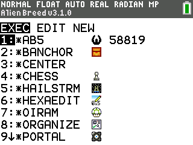

# CEaShell  

CEaShell (prononcé "Seashell") est un nouveau shell pour la TI-83 Premium CE et la TI-84 Plus CE (Edition Python). Il vise à fournir une interface utilisateur moderne, élégante et facile à utiliser, compréhensible par tout utilisateur, quelle que soit son expérience ou ses connaissances en matière de calculatrice. Pour obtenir de l'aide, suggérer une fonctionnalité ou signaler un bug, rejoignez notre Discord !

## Captures d'écran

 
 
 

## Fonctionnalités

* Thèmes de couleurs personnalisables, y compris des thèmes prédéfinis et la possibilité de créer des thèmes entièrement personnalisés.
* Quatre échelles pour afficher les fichiers dans le shell, permettant de voir jusqu'à 18 fichiers à la fois.
* Exécution de programmes et d'applications.
* Visualisation et modification des informations de fichiers (Archivage / désarchivage, masquage / démasquage, verrouillage / déverrouillage, renommage, suppression, édition).
* Recherche de fichiers.
* Intégration avec [HexaEdit](https://github.com/captain-calc/HexaEdit-CE) pour ouvrir des fichiers dans l'éditeur hexadécimal, si l'utilisateur a installé HexaEdit sur sa calculatrice.
* Création et copie de programmes et d'AppVars.
* Éteindre la calculatrice tout en étant dans le shell et retourner au shell après avoir rallumé la calculatrice.
* Voir les icônes, descriptions et taille des fichiers dans les menus [apps] et [prgm] de TI-OS.
* [Raccourcis](#shortcuts) dans TI-OS pour lancer le shell, inverser les couleurs de l'OS, déclencher l'APD et sauter aux étiquettes dans l'éditeur de programmes de TI-OS.
* Raccourcis personnalisés pour lancer des programmes et des applications.
* Activer l'édition des programmes archivés dans TI-OS.
* Permettre l'édition des programmes verrouillés dans CEaShell.
* Défilement rapide en alpha dans l'éditeur TI-OS.
* Capacité de masquer le menu "Programmation" sur les calculatrices Python, en passant directement à un menu TI-BASIC comme les calculatrices non-Python.
* Désactiver l'indicateur de charge lorsque vous exécutez des programmes TI-BASIC via CEaShell.
* Activer les minuscules dans TI-OS.

## Installation

1. Téléchargez la dernière version de CEaShell depuis [la page des sorties GitHub](https://github.com/roccoloxprograms/CEaShell/releases/latest), ou clonez et compilez CEaShell en suivant [ces instructions](#building-ceashell).
2. Envoyez **CEASHELL.8xp** et **AppInstA.8xv** à votre calculatrice en utilisant TI-Connect CE ou TiLP. Si vous n'avez pas les [bibliothèques CE C](https://tiny.cc/clibs), vous devrez les télécharger et les envoyer également.
3. Exécutez **prgmCEASHELL** depuis le menu des programmes (vous devrez utiliser le [jailbreak arTIfiCE](https://yvantt.github.io/arTIfiCE) si vous êtes sur une version OS 5.5 et supérieure).
4. CEaShell sera installé dans le menu des applications.

## Désinstallation

1. Ouvrez le menu de gestion de la mémoire en appuyant sur <kbd>2nde</kbd>, <kbd>+</kbd>, <kbd>2</kbd>.
2. Faites défiler vers le bas jusqu'à ce que vous trouviez une option "Apps".
3. Appuyez sur <kbd>enter</kbd> puis trouvez CEaShell.
4. Appuyez sur <kbd>suppr</kbd> puis appuyez sur <kbd>2</kbd>.
5. Quittez le menu de gestion de la mémoire en appuyant sur <kbd>annul</kbd>.

## Navigation

Voici un tableau avec les touches et leurs différentes utilisations dans CEaShell :

| Touche                                                                     | Action effectuée                                                                                                                 |
|----------------------------------------------------------------------------|----------------------------------------------------------------------------------------------------------------------------------|
| <kbd>2nde</kbd> / <kbd>entrer</kbd>                                        | Exécuter des programmes, basculer/sélectionner des éléments dans les menus.                                                      |
| <kbd>↑</kbd>, <kbd>↓</kbd>, <kbd>←</kbd>, <kbd>→</kbd>                     | Faire défiler les options ou les menus.                                                                                          |
| <kbd>f(x)</kbd>                                                            | Ouvrir/fermer le menu de personnalisation.                                                                                       |
| <kbd>graphe</kbd>                                                          | Ouvrir/fermer le menu des paramètres.                                                                                            |
| <kbd>alpha</kbd> / <kbd>fenêtre</kbd> / <kbd>zoom</kbd> / <kbd>trace</kbd> | Voir et modifier les propriétés des fichiers.                                                                                    |
| <kbd>suppr</kbd>                                                           | Supprimer le fichier actuellement sélectionné ou supprimer le caractère devant le curseur dans une zone de saisie.               |
| <kbd>mode</kbd>                                                            | Créer un nouveau fichier ou copier celui actuellement sélectionné, ou effacer dans une zone de saisie.                           |
| <kbd>var</kbd>                                                             | Ouvrir rapidement le fichier actuellement sélectionné dans l'éditeur TI-OS, si le fichier peut être édité.                       |
| <kbd>annul</kbd>                                                           | Quitter CEaShell ou revenir au menu précédent. Pour quitter CEaShell de n'importe où dans le shell, maintenez enfoncé.           |
| <kbd>a</kbd> - <kbd>z</kbd>, <kbd>θ</kbd>                                  | Aller au programme commençant par la lettre pressée.                                                                             |
| <kbd>on</kbd>                                                              | Éteindre la calculatrice tout en restant dans le shell.                                                                          |
| <kbd>stats</kbd>                                                           | Rechercher un fichier. Par exemple, rechercher "ABC" affichera tous les fichiers commençant par "ABC" dans le répertoire actuel. |

## Créer des thèmes personnalisés

1. Pour créer un thème personnalisé, ouvrez d'abord le menu de personnalisation en utilisant <kbd>f(x)</kbd>.
2. Faites défiler et trouvez "Custom theme", puis appuyez sur <kbd>2nde</kbd> ou <kbd>entrer</kbd> pour ouvrir le créateur de thèmes.
3. Dans le créateur de thèmes, utilisez le bouton <kbd>mode</kbd> pour basculer l'élément UI dont la couleur est modifiée. Déplacez le sélecteur de couleur en utilisant les touches <kbd>↑</kbd>, <kbd>↓</kbd>, <kbd>←</kbd> ou <kbd>→</kbd>.
4. Lorsque vous êtes satisfait de vos choix de couleurs, appuyez sur <kbd>2nde</kbd> ou <kbd>entrer</kbd> pour enregistrer les modifications. Si vous souhaitez quitter le sélecteur de thèmes sans enregistrer vos modifications, appuyez sur <kbd>annul</kbd>.

## Raccourcis

Si l'option **[on] Shortcuts** est activée dans CEaShell, les combinaisons de touches suivantes effectueront des utilités spécifiques dans l'OS :

| Combinaison de touches                      | Action effectuée                                                                                                  |
|---------------------------------------------|-------------------------------------------------------------------------------------------------------------------|
| <kbd>on</kbd> + <kbd>prgm</kbd>             | Lancer CEaShell.                                                                                                  |
| <kbd>on</kbd> + <kbd>sto →</kbd>            | Inverser les couleurs de l'OS ("Mode sombre").                                                                     |
| <kbd>on</kbd> + <kbd>ln</kbd>               | Désinverser les couleurs de l'OS.                                                                                  |
| <kbd>on</kbd> + <kbd>stat</kbd>             | Éteindre la calculatrice et conserver votre position dans l'OS.                                                    |
| <kbd>on</kbd> + <kbd>graph</kbd>            | Sauter à une étiquette de programme dans l'éditeur de programmes de l'OS.                                          |
| <kbd>on</kbd> + <kbd>0</kbd> - <kbd>9</kbd> | Lancer le programme ou l'application assigné à la touche numérique pressée. Les fichiers peuvent être assignés à un numéro dans le menu d'informations. |

## Construction de CEaShell

Pour "construire" CEaShell, vous devrez installer la dernière version de [l'outil CE C](https://ce-programming.github.io/toolchain/index.html). Les instructions pour installer l'outil se trouvent [ici](https://ce-programming.github.io/toolchain/static/getting-started.html#installing-the-ce-toolchain). Vous devrez également utiliser la dernière version de [convimg](https://github.com/mateoconlechuga/convimg).

 

1. Clonez CEaShell avec le sous-module **app_tools** en exécutant `git clone --recurse-submodules https://github.com/RoccoLoxPrograms/CEaShell`
2. Si vous utilisez un OS qui utilise `python3` au lieu de `python`, ouvrez **app_tools/makefile** et changez `PYTHON_VER := python` en `PYTHON_VER := python3`.
3. Si vous souhaitez construire la version française de CEaShell, ouvrez le **makefile** de CEaShell (pas celui de **app_tools**) et changez `LANGUAGE = EN` en `LANGUAGE = FR`.
4. Dans une ligne de commande, `cd` dans le dépôt cloné, et exécutez `make gfx`.
5. Une fois terminé, exécutez `make`. Les binaires compilés seront dans le nouveau répertoire **bin**.

## Bugs

Si vous rencontrez un bug en utilisant CEaShell, n'hésitez pas à [ouvrir un dossier (issue)](https://github.com/RoccoLoxPrograms/CEaShell/issues) ou à nous le signaler sur notre [serveur Discord](https://discord.gg/RDTtu258fW).
