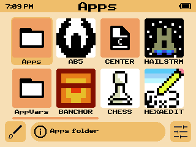
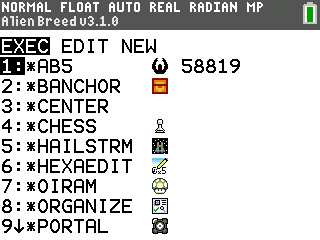
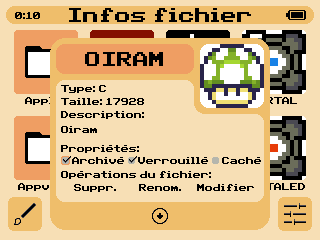
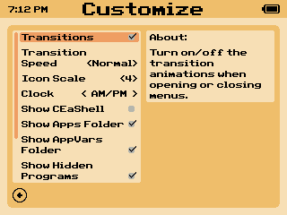
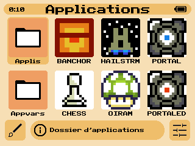
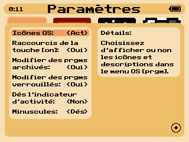

# CEaShell  

CEaShell (pronounced like "Seashell") is a new shell for the TI-84 Plus CE. It aims to provide a modern, sleek, and easy to use UI, which is understandable by any user regardless of previous experience or calculator-related knowledge. To get help, suggest a feature, or report a bug, join the discord!

## Screenshots

    
      
      

## Features

* Customizable color themes, including preset themes and the ability to create fully custom themes.
* Four scales for displaying files in the shell, allowing for viewing up to 18 files at once.
* Program and OS app running.
* Viewing and modifying of file information. (Archiving / unarchiving, hiding / unhiding, locking / unlocking, renaming, deleting, editing)
* Creating and copying of programs and AppVars.
* Turning off the calculator while in the shell, and returning to the shell after turning the calculator back on.
* Option to view icons and descriptions in the TI-OS [apps] and [prgm] menus.
* [Shortcuts](#shortcuts) in TI-OS to launch the shell, invert OS colors, trigger APD, and jump to labels in the TI-OS program editor.
* Option to allow editing of archived programs in TI-OS.
* Option to allow editing of locked programs in CEaShell.
* Option to hide the "Programming" menu on Python calculators, skipping directly to a TI-BASIC menu like non-Python calcs.
* Option to disable the busy indicator when running TI-BASIC programs through CEaShell.
* Option to enable lowercase in TI-OS.

## Installation

~~1. Download the latest version of CEaShell from [the GitHub releases page](https://github.com/roccoloxprograms/CEaShell/releases/latest).~~
1. Clone and build CEaShell, following [these instructions](#building-ceashell).
2. Send **CEASHELL.8xp** and **AppInstA.8xv** to your calculator using TI-Connect CE or TiLP.
3. Run **prgmCEASHELL** from the programs menu (You will need to use the [arTIfiCE jailbreak](https://yvantt.github.io/arTIfiCE) if you are on an OS version 5.5 and above).
4. CEaShell will be installed in the apps menu.

## Uninstalling

1. Open the memory management menu by pressing <kbd>2nd</kbd>, <kbd>+</kbd>, <kbd>2</kbd>.
2. Scroll down until you find an option "Apps".
3. Press <kbd>enter</kbd> and then find CEaShell.
4. Press <kbd>del</kbd> and then press <kbd>2</kbd>.
5. Exit the memory management menu by pressing <kbd>clear</kbd>.

## Navigation

Below is a table with keys and their various usage in CEaShell:

| Key                                                                       | Action performed                                             |
|---------------------------------------------------------------------------|--------------------------------------------------------------|
| <kbd>2nd</kbd> / <kbd>enter</kbd>                                         | Run programs, toggle/select items in menus.                  |
| <kbd>↑</kbd>, <kbd>↓</kbd>, <kbd>←</kbd>, <kbd>→</kbd>                    | Scroll through options or menus.                             |
| <kbd>y=</kbd>                                                             | Open/exit customization menu.                                |
| <kbd>graph</kbd>                                                          | Open/exit settings menu.                                     |
| <kbd>alpha</kbd> / <kbd>window</kbd> / <kbd>zoom</kbd> / <kbd>trace</kbd> | View and modify file properites.                             |
| <kbd>del</kbd>                                                            | Delete currently selected file.                              |
| <kbd>mode</kbd>                                                           | Create a new file or copy the currently selected one.        |
| <kbd>clear</kbd>                                                          | Exit CEaShell, or in some cases return to the previous menu. |
| <kbd>a</kbd> - <kbd>z</kbd>, <kbd>θ</kbd>                                 | Jump to the program beginning with the letter pressed.       |
| <kbd>on</kbd>                                                             | Turn off the calculator while remaining in the shell.        |

## Creating custom themes

1. To create a custom theme, first open the customization menu using <kbd>y=</kbd>.
2. Scroll and find "Custom theme", then press <kbd>2nd</kbd> or <kbd>enter</kbd> to open the theme creator.
3. While in the theme creator, use the <kbd>mode</kbd> button to toggle which UI element's color is being modified. Move the color selector using the <kbd>↑</kbd>, <kbd>↓</kbd>, <kbd>←</kbd>, or <kbd>→</kbd> keys.
4. When you are satisfied with your color choices, press either <kbd>2nd</kbd> or <kbd>enter</kbd> to save the changes. If you wish to exit the theme picker without saving your changes, press <kbd>clear</kbd> instead.

## Shortcuts

If the option **[on] Shortcuts** is enabled in CEaShell, the follow key combinations will preform specific utilities in the OS:

| Key combination                  | Action performed                                                |
|----------------------------------|-----------------------------------------------------------------|
| <kbd>on</kbd> + <kbd>prgm</kbd>  | Launch CEaShell.                                                |
| <kbd>on</kbd> + <kbd>sto →</kbd> | Invert OS colors ("Dark mode").                                 |
| <kbd>on</kbd> + <kbd>ln</kbd>    | Un-invert OS colors.                                            |
| <kbd>on</kbd> + <kbd>stat</kbd>  | Turn off the calculator, and preserve where you were in the OS. |
| <kbd>on</kbd> + <kbd>graph</kbd> | Jump to a program label in the OS program editor.               |

## Building CEaShell

To build CEaShell, you will need to install the latest version of the [CE C toolchain](https://ce-programming.github.io/toolchain/index.html). Instructions to install the toolchain can be found [here](https://ce-programming.github.io/toolchain/static/getting-started.html#installing-the-ce-toolchain). You will also need to use the latest version of [convimg](https://github.com/mateoconlechuga/convimg).

 

1. Clone CEaShell with the **app_tools** submodule by running `git clone --recurse-submodules https://github.com/RoccoLoxPrograms/CEaShell`
2. If you are using an OS that uses `python3` insead of `python`, open **app_tools/makefile** and change `PYTHON_VER := python` to `PYTHON_VER := python3`.
3. If you would like to build the French version of CEaShell (translation not yet completed), open CEaShell's **makefile** (not the **app_tools** one) and change `LANGUAGE = EN` to `LANGUAGE = FR`.
4. In a command line, `cd` into the cloned repository, and run `make gfx`.
5. Once complete, run `make`. The compiled binaries will be in the newly created **bin** directory.

## Bugs

If you encounter a bug while using CEaShell, don't hesitate to [make an issue](https://github.com/RoccoLoxPrograms/CEaShell/issues) or report it on the [Discord server](https://discord.gg/RDTtu258fW).
Feel free to request features or ask for help on the discord or in the [Cemetech topic](https://ceme.tech/t18820) as well!

## Translation

CEaShell 1.1.5 (the latest GitHub release) has also been translated to French by [Shadow](https://github.com/Bryankaveen). The rewritten CEaShell (v2.0.0+) has not been translated yet.

## Credits

A more detailed credits can be found in CEaShell. [**app_tools**](https://github.com/commandblockguy/app_tools) is created by [commandblockguy](https://github.com/commandblockguy/), and some of the assembly was written by [MateoConLechuga](https://github.com/mateoconlechuga/).

© 2022 - 2023 RoccoLox Programs and TIny_Hacker
