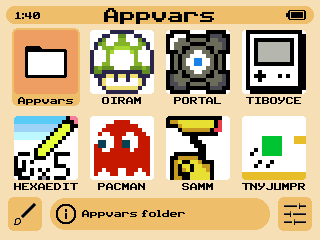

# CEaShell  
[//]: <> (Yes I know the beta is only on discord maybe we'll put it on GitHub eventually. Congrats if you can see this, it's supposed to be a secret!🤫)

CEaShell (pronounced like "Seashell") is a new shell for the TI-84 Plus CE. It aims to provide a modern, sleek, and easy to use UI, which is understandable by any user regardless of previous experience or calculator-related knowledge. To get help, suggest a feature, or report a bug, join the discord!

## Screenshots

    
      ![Program icons in the [prgm] menu](screenshots/programs.png "Program Icons in the [prgm] menu")

