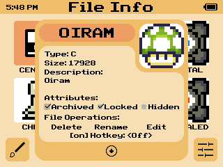
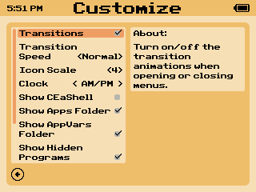
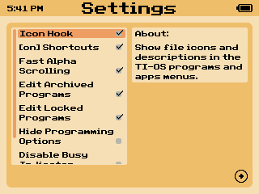

# CEaShell  

CEaShell (pronounced like "Seashell") is a new shell for the TI-84 Plus CE. It aims to provide a modern, sleek, and easy to use UI, which is understandable by any user regardless of previous experience or calculator-related knowledge. To get help, suggest a feature, or report a bug, join the discord!

## Screenshots

    
      
      

## Features

* Program and OS app running
* Custom color themes and visual preferences
* Viewing of program information
* Modifying of file properties (Archiving/Unarchiving, Hiding/Unhiding, etc.)
* Editing of TI-BASIC programs
* Creating of programs and appvars
* OS enhancements
* Program icons and descriptions in the OS programs menu
* And many more!

## Installation

1. Download the latest version of CEaShell from [the GitHub releases page](https://github.com/roccoloxprograms/CEaShell/releases/latest).
2. Send **APPINST.8xp**, **AppInstA.8xv**, and **AppInstB.8xv** to your calculator using TI-Connect CE or TiLP.
3. Run **prgmAPPINST** from the programs menu (You will need to use the [arTIfiCE jailbreak](https://yvantt.github.io/arTIfiCE) if you are on an OS version 5.5 and above).
4. CEaShell will be installed in the apps menu.

## Uninstalling

1. Open the memory management menu by pressing <kbd>2nd</kbd>, <kbd>+</kbd>, <kbd>2</kbd>.
2. Scroll down until you find an option "Apps".
3. Press <kbd>enter</kbd> and then find CEaShell.
4. Press <kbd>del</kbd> and then press <kbd>2</kbd>.
5. Exit the memory management menu by pressing <kbd>clear</kbd>.

## Navigation

Below is a table with keys and their various usage in CEaShell:

| Key                                                                       | Action performed                                       |
|---------------------------------------------------------------------------|--------------------------------------------------------|
| <kbd>2nd</kbd> / <kbd>enter</kbd>                                           | Run programs, toggle/select items in menus.            |
| <kbd>↑</kbd>, <kbd>↓</kbd>, <kbd>←</kbd>, <kbd>→</kbd>                    | Scroll through options or menus.                       |
| <kbd>y=</kbd>                                                             | Open/exit customization menu.                          |
| <kbd>graph</kbd>                                                          | Open/exit settings menu.                               |
| <kbd>alpha</kbd> / <kbd>window</kbd> / <kbd>zoom</kbd> / <kbd>trace</kbd> | View and modify file properites.                       |
| <kbd>del</kbd>                                                            | Delete currently selected file.                        |
| <kbd>mode</kbd>                                                           | Create a new file or copy the currently selected one.  |
| <kbd>clear</kbd>                                                          | Exit CEaShell.                                         |
| <kbd>a</kbd> - <kbd>z</kbd>                                               | Jump to the program beginning with the letter pressed. |
| <kbd>on</kbd>                                                             | Turn off the calculator while remaining in the shell.  |

## Shortcuts

If the option **[on] key shortcuts** is enabled in CEaShell, the follow key combinations will preform specific utilities in the OS:

| Key combination                  | Action performed                                                |
|----------------------------------|-----------------------------------------------------------------|
| <kbd>on</kbd> + <kbd>prgm</kbd>  | Launch CEaShell.                                                |
| <kbd>on</kbd> + <kbd>sto →</kbd> | Invert OS colors ("Dark mode").                                 |
| <kbd>on</kbd> + <kbd>ln</kbd>    | Un-invert OS colors.                                            |
| <kbd>on</kbd> + <kbd>stat</kbd>  | Turn off the calculator, and preserve where you were in the OS. |
| <kbd>on</kbd> + <kbd>graph</kbd> | Jump to a program label in the OS program editor.               |

## Building CEaShell

Make sure you have installed the linker relocations branch of the [CE C Toolchain](https://github.com/ce-programming/toolchain). CEaShell will not be able to compile using the main version. You will also need to use the latest version of [convimg](https://github.com/mateoconlechuga/convimg).

 

1. Clone CEaShell with the **app_tools** submodule by running `git clone --recurse-submodules https://github.com/RoccoLoxPrograms/CEaShell`
2. If you are using an OS that uses `python3` insead of `python`, open **app_tools/makefile** and change `PYTHON_VER := python` to `PYTHON_VER := python3`.
3. `cd` into the cloned repository, and run `make gfx`.
4. Once complete, run `make`. The compiled binaries will be in the newly created **bin** directory.

## Bugs

If you encounter a bug while using CEaShell, don't hesitate to [make an issue](https://github.com/RoccoLoxPrograms/CEaShell/issues) or report it on the [Discord server](https://discord.gg/RDTtu258fW).
Feel free to request features or ask for help on the discord or in the [Cemetech topic](https://ceme.tech/t18820) as well!

## Translation

Currently, there is a French translation of CEaShell which is translated by [Shadow](https://github.com/Bryankaveen).
You can find it [here](https://github.com/RoccoLoxPrograms/CEaShell/tree/french-translation).

## Credits

A more detailed credits can be found in CEaShell. [**app_tools**](https://github.com/commandblockguy/app_tools) is created by [commandblockguy](https://github.com/commandblockguy/), and some of the assembly was written by [MateoConLechuga](https://github.com/mateoconlechuga/).

© 2022 - 2023 RoccoLox Programs and TIny_Hacker
